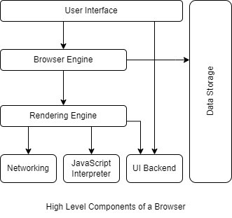

# How the web browser works
A browser is a software application used to locate, retrieve and display content on the World Wide Web, including Web pages, images, video and other files. As a client/server model, the browser is the client run on a computer that contacts the Web server and requests information. 

**When you type a web address into your browser:**

 - The browser goes to the DNS server, and finds the real address of the server that the website lives on.
 - The browser sends an HTTP request message to the server, asking it to send a copy of the website to the client. This message, and all other data sent between the client and the server, is sent across your internet connection using TCP/IP.
- If the server approves the client's request, the server sends the client a "200 OK" message and then starts sending the website's files to the browser as a series of small chunks called data packets.
- The browser assembles the small chunks into a complete web page and displays it to you.

# A browser's high level structure
### The browser's main components are:
### The user interface
This includes the address bar, back/forward button, bookmarking menu, etc. Every part of the browser display except the window where you see the requested page.
### The browser engine
Marshals actions between the UI and the rendering engine.
### The rendering engine
Responsible for displaying requested content. For example if the requested content is HTML, the rendering engine parses HTML and CSS, and displays the parsed content on the screen.
### Networking
For network calls such as HTTP requests, using different implementations for different platform behind a platform-independent interface.
### UI backend
Used for drawing basic widgets like combo boxes and windows. This backend exposes a generic interface that is not platform specific. Underneath it uses operating system user interface methods.
###  JavaScript interpreter
Used to parse and execute JavaScript code.
### Data storage
This is a persistence layer. The browser may need to save all sorts of data locally, such as cookies. Browsers also support storage mechanisms such as localStorage, IndexedDB, WebSQL and FileSystem.

It is important to note that browsers such as Chrome run multiple instances of the rendering engine: one for each tab. Each tab runs in a separate process.

# Rendering Engine
The responsibility of the rendering engine is to display the requested contents on the browser screen.

By default the rendering engine can display HTML and XML documents and images. It can display other types of data via plug-ins or extension; for example, displaying PDF documents using a PDF viewer plug-in.

Different browsers use different rendering engines: Internet Explorer uses Trident, Firefox uses Gecko, Safari uses WebKit. Chrome and Opera (from version 15) use Blink, a fork of WebKit.

WebKit is an open source rendering engine which started as an engine for the Linux platform and was modified by Apple to support Mac and Windows.

The rendering engine will start getting the contents of the requested document from the networking layer. This will usually be done in 8kB chunks.

The rendering engine will start parsing the HTML document and convert elements to DOM nodes in a tree called the "content tree". The engine will parse the style data, both in external CSS files and in style elements. Styling information together with visual instructions in the HTML will be used to create another tree: the render tree.

The render tree contains rectangles with visual attributes like color and dimensions. The rectangles are in the right order to be displayed on the screen.

After the construction of the render tree it goes through a "layout" process. This means giving each node the exact coordinates where it should appear on the screen. The next stage is painting - the render tree will be traversed and each node will be painted using the UI backend layer.

It's important to understand that this is a gradual process. For better user experience, the rendering engine will try to display contents on the screen as soon as possible. It will not wait until all HTML is parsed before starting to build and layout the render tree. Parts of the content will be parsed and displayed, while the process continues with the rest of the contents that keeps coming from the network.