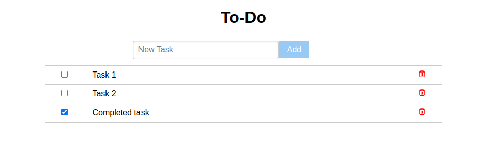

# React To-Do App

Install dependencies:

```sh
npm install
```

Start the project at [`http://localhost:3000`](http://localhost:3000).

```sh
npm start
```
### Demo link
[Demo link](https://mrg-todo.netlify.app/)

### App Screenshot
<div align="center">
    
</div>